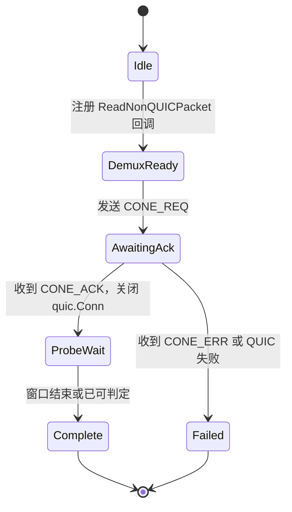
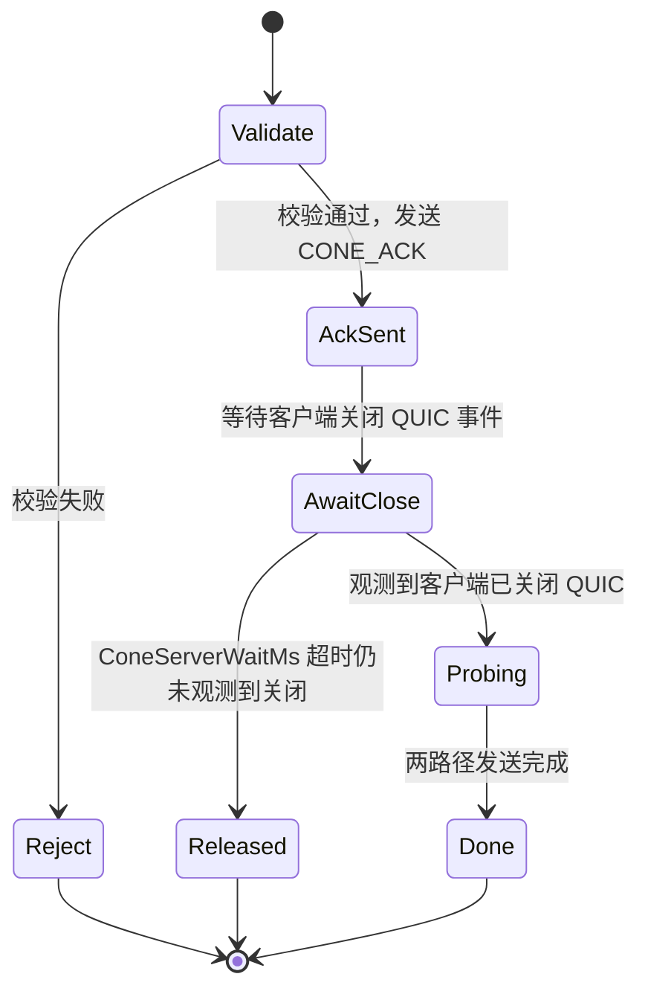
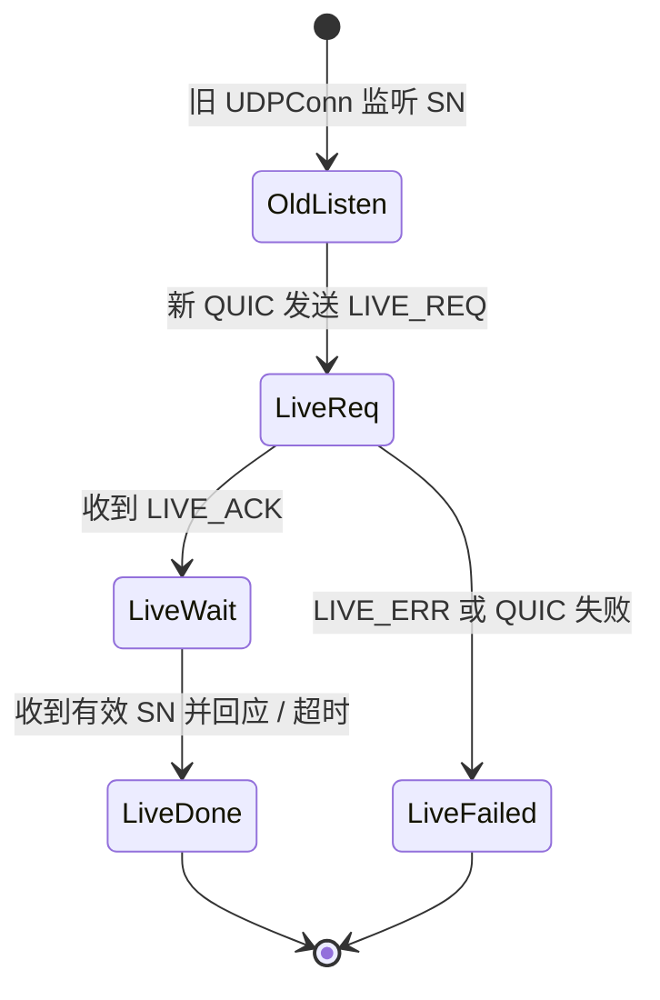
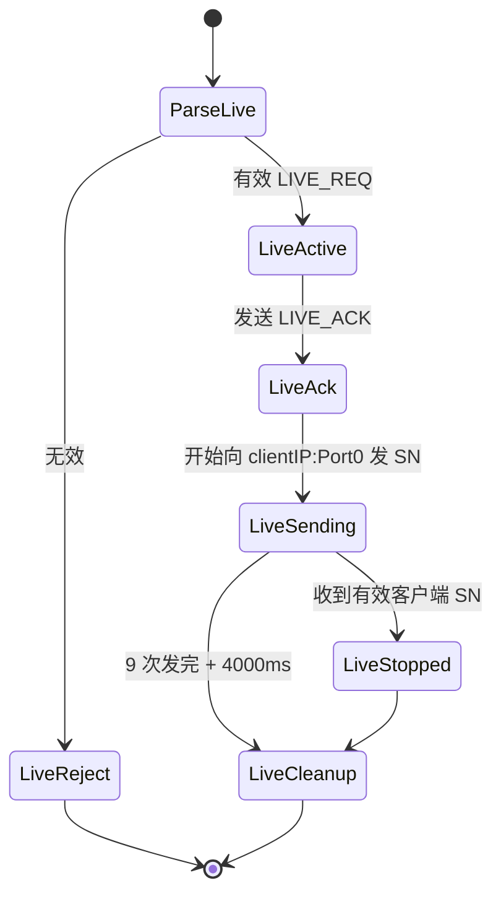

# Transaction Spec v1 — `STUN:Addr` / `STUN:Cone` / `STUN:Live` 状态机与生命周期

## 来源追溯

| 来源 | 章节 |
|------|------|
| `conception/conelevel.md` | 正式探测 Step.1–4、消息发送、客户端超时、附：判断矩阵 |
| `conception/keepalive.md` | Step.1–2、服务端操作、探测循环 |
| `decision/DEC-0001-layer-boundary.md` | 单次请求内最小服务行为、NAT 类型结果语义 |
| `decision/DEC-0002-transaction-concurrency.md` | 同 `UDPConn` 并发约束、禁止按远端 IP 区分 transaction |
| `decision/DEC-0003-cone-closure-and-cleanup.md` | Cone 关闭握手（QUIC 关闭事件）、服务端等待超时、`PreAckQueue` 废止 |
| `decision/DEC-0004-live-localip-binding.md` | Live 服务端 `LocalIP`/绑定 |
| `decision/DEC-0009-service-payload-encoding.md` | Live 重复请求去重规则 |
| `proposal/wire-spec-v1.md` | 控制帧、Payload 字段 |
| `proposal/sn-spec-v1.md` | SN 构造、验证 |

本文档为 **强规范**，定义单次 transaction 内双方 **MUST** 一致的状态迁移、竞态处理与冗余发送时序。

 粗测/精测调度、多节点 Addr 预探测、受托节点选择 **不** 在本文档范围（应用层，`DEC-0001`）。

---

## 1. 共用定义

### 1.1 Transaction 与并发约束（`DEC-0002`）

一次 **transaction** 指：**客户端**发出一条 `*_REQ` 起，到探测窗口结束或收到明确 `*_ERR` 止的完整交互。每个 transaction 绑定一个 `RequestID`（控制面）和一份 `Key32`（探测面，Cone/Live 均有）。

- **协议层 MUST**：同一 `net.UDPConn` 上，任意时刻 **最多只能有一个** 处于探测等待状态的 `STUN:Cone` transaction。
- **协议层 MUST**：同一 `net.UDPConn`（对应同一个 `Port0` 映射）上，任意时刻 **最多只能有一个** 未完成的 `STUN:Live` transaction。
- **应用层**：客户端是否同时对多个服务节点发起 Cone 或 Live 探测以提升可靠性，属应用层调度策略；若选择并发，**MUST** 为每个并发 transaction 各自创建独立的 `net.UDPConn`，上述两条规则在每个 `UDPConn` 内部仍然适用。
- **协议层 MUST NOT**：任何实现 **MUST NOT** 依赖"远端 IP"区分并发 transaction——`NewHost` 源 IP 对客户端设计上不可预知（`sn-spec-v1.md` §5）。

### 1.2 非 QUIC 包 demux

在任意持有 `quic.Transport` 的实现中，**MUST** 持续调用 `ReadNonQUICPacket()`（或等价循环），将裸 UDP 载荷交给当前 **活跃 transaction** 的 SN 处理器。

- 无活跃 transaction 时收到的 SN **MUST** 丢弃。
- 同一时刻最多一个 Cone 或 Live transaction 处于"等待 SN"状态（§1.1）。

### 1.3 时间基准

| 名称 | 起点 |
|------|------|
| `T_close_cone`（客户端） | 客户端 **发起关闭** 自身 QUIC 连接的时刻（收到 `CONE_ACK` 后立即触发） |
| `T_ack_live` | 客户端完整收到 `LIVE_ACK` 帧的时刻 |
| `ConeWaitMs`（客户端） | 客户端本地探测等待窗口，默认 **5000**，自 `T_close_cone` 起算；**MAY** 按网络状况调整（`DEC-0003` §3） |
| `ConeServerWaitMs`（服务端） | 服务端等待观测到客户端 QUIC 关闭事件的独立定时器，默认 **5000**（`DEC-0003` §2） |
| `LiveWindowMs` | 固定 **12000**，自 `T_ack_live` 起算 |

---

## 2. `STUN:Cone` Transaction

### 2.1 角色与通道

| 阶段 | QUIC | 裸 UDP（同一 `UDPConn`） |
|------|------|--------------------------|
| 请求 | `CONE_REQ` → `CONE_ACK` / `CONE_ERR` | 尚未处理 SN |
| 探测 | **MUST** 已关闭（客户端主动关闭，服务端观测该事件后才发包） | 发送 SN |

关闭 `quic.Conn` **MUST NOT** 关闭底层 `UDPConn`。

### 2.2 客户端状态机

| 状态 | 行为 |
|------|------|
| `DemuxReady` | 已启动 non-QUIC 读取；此阶段收到的任何裸 UDP 载荷均非本 transaction 合法探测包，**MUST** 直接丢弃（无需暂存，见 §2.4） |
| `AwaitingAck` | 阻塞读 stream 直至完整 `CONE_ACK` 或 `CONE_ERR`；此阶段收到的裸 UDP 载荷同样 **MUST** 丢弃 |
| `ProbeWait` | 已关闭 `quic.Conn`（保留 `UDPConn`）；处理实时到达的 SN；维护 `NewPortSeen` / `NewHostSeen` |
| `Complete` | 输出二元结果；停止关联此 transaction 的 SN 处理 |

**客户端 MUST** 在发送 `CONE_REQ` **之前** 进入 `DemuxReady`。

收到 `CONE_ACK` 后 **MUST**：

1. 关闭自身 `quic.Conn`（保留 `UDPConn`），记录 `T_close_cone`；
2. 启动 `ConeWaitMs` 超时定时器（自 `T_close_cone` 起算）；
3. 进入 `ProbeWait`。

**提前结束（SHOULD）**：若已满足 `conception/conelevel.md` Step.4 判定（例如 `NewHost` 已收到且可确定为 `FullCone`/`OpenInternet`），**MAY** 在 `ConeWaitMs` 届满前结束等待。

### 2.3 服务端状态机

| 状态 | 行为 |
|------|------|
| `Validate` | 解析 `CONE_REQ`；检查 `Exclist` 上限（`ExclistCount ≤ 256`） |
| `AckSent` | `CONE_ACK` 已写入 stream 且 **MUST** 刷至对端 |
| `AwaitClose` | 启动独立于 QUIC `MaxIdleTimeout` 的等待定时器（`ConeServerWaitMs`，默认 5000ms）；持续观测该客户端 QUIC 连接的传输层关闭事件 |
| `Probing` | 观测到关闭事件后，**MUST** 并发调度 `NewPort` 与 `NewHost` 两条路径发送 SN（§2.4） |
| `Done` | 两路径均完成冗余发送；**MUST** 主动关闭与该客户端的 QUIC 连接（如尚未关闭）；释放 transaction 状态 |
| `Released` | `ConeServerWaitMs` 到期仍未观测到客户端关闭 QUIC，**MUST** 释放 transaction 状态且 **MUST NOT** 发送任何探测 SN |

**关闭握手机制**（`DEC-0003` §1）：服务端 **MUST** 通过 QUIC 传输层自身的连接关闭事件判定客户端已关闭连接，**不** 引入额外的应用层"确认"消息。

**等待定时器**（`DEC-0003` §2）：`ConeServerWaitMs` **MUST** 独立于 QUIC 连接的 `MaxIdleTimeout` 配置维护，避免客户端异常消失时服务端资源被动长期占用。

**`NewPort`**：从**同一主机**新 UDP socket（新本地端口）向客户端 `ObservedAddr` 发 SN。
**`NewHost`**：从新 IP（本机别名或受托节点）向同一目标发 SN；HMAC key **MUST** 为 `SHA256(Key32)`（`sn-spec-v1.md` §3.2）；服务器使用的新 IP **MUST** 与原连接 IP 同簇（同为 IPv4 或 IPv6）。

每条路径独立按 §2.5 冗余发送；**MUST NOT** 复用同一 SN 字节串。

### 2.4 `ProbeWait` 之前收到的载荷（`PreAckQueue` 已废止，`DEC-0003` 附注）

服务端在观测到客户端关闭 QUIC 连接之前 **MUST NOT** 发送任何探测 SN；客户端关闭 QUIC 连接这一动作发生在收到 `CONE_ACK` **之后**。因此任何合法探测 SN 在时间上只可能出现在客户端已进入 `ProbeWait` 之后。

`DemuxReady`/`AwaitingAck` 阶段收到的任何裸 UDP 载荷 **MUST** 直接丢弃，**不** 引入队列暂存机制（此前设计的 `PreAckQueue` 已废止，不应在实现中出现）。

### 2.5 冗余发送参数（`conelevel.md`"消息发送"节）

| 参数 | 值 |
|------|-----|
| 每路径发送次数 | **5**（NewPort） 或 **3**（NewHost） |
| NewPort 间隔 | `100–400 ms` 随机取值 |
| NewHost 间隔 | 第 1→2 次：`100–300 ms`；第 2→3 次：`400–800 ms` |
| 累计时长 | `≤2s`（NewPort）或 `500ms – 1.1s`（NewHost） |

服务器按规则发送即可，不等待客户端回应（探测面无回应机制）。每次发送 **MUST** 重新生成完整 SN。

### 2.6 客户端超时与结果

| 条件 | 单次 transaction 输出 |
|------|------------------------|
| `ConeWaitMs` 内无有效 SN | `NewPortSeen=false`, `NewHostSeen=false` |
| 仅 `NewPort` | `NewPortSeen=true`, `NewHostSeen=false` |
| 仅 `NewHost` | `NewPortSeen=false`, `NewHostSeen=true` |
| 两者皆有 | 均为 `true` |

与预探测组合的最终 NAT 类型判定见 §5；**不** 在本 transaction 内完成。

### 2.7 竞态与 QUIC 交错

- 在 `ProbeWait` 阶段，**MUST NOT** 再发起新的 QUIC stream（同一 `UDPConn` 上已无 QUIC 会话）。
- 若 `CONE_ERR` 到达，客户端 **MUST NOT** 将后续 SN 归属该 transaction。
- 服务端在 `Reject` 后 **MUST NOT** 发送探测 SN。
- 服务端 **MUST** 在 `Done` 后主动关闭与客户端的 QUIC 连接（不依赖客户端单方面关闭），统一资源清理责任方（`DEC-0003` §4）。

---

## 3. `STUN:Live` Transaction

### 3.1 双连接模型

Live 探测 **MUST** 使用两条客户端路径：

| 路径 | 用途 |
|------|------|
| **旧 `UDPConn`**（`Port0` 映射） | 接收服务端 SN；发送客户端回应 SN |
| **新 `UDPConn` + 新 QUIC** | 发送 `LIVE_REQ`，接收 `LIVE_ACK` |

客户端 **MUST** 用**新随机本地端口**创建新 QUIC，避免在旧映射上发送数据刷新 NAT 计时器（`keepalive.md` Step.1）。

### 3.2 客户端状态机

| 状态 | 行为 |
|------|------|
| `OldListen` | 旧 conn 已注册 SN 处理器（无活跃 Live transaction 时不回应） |
| `LiveReq` | 新 QUIC stream 发 `LIVE_REQ{Key32, Port0}` |
| `LiveWait` | 自 `T_ack_live` 起 `LiveWindowMs`（12000ms）内等待服务端 SN |
| `LiveDone` | 记录 `MappingAlive` 布尔结果 |

收到首个有效服务端 SN 后，客户端 **MUST**：

1. 标记 `Responded=true`；
2. 立即发送自构 SN（`LocalIP`=客户端公网 IP，见 `sn-spec-v1.md` §3.4）；
3. 再发 **2** 个新 SN，间隔 **100 ms**（共 3 包）；
4. 之后同一 transaction 内收到更多服务端 SN **MUST NOT** 再回应。

**超时**：`T_ack_live + 12000 ms` 内未收到有效服务端 SN ⇒ `MappingAlive=false`。

### 3.3 服务端状态机

| 步骤 | 说明 |
|------|------|
| 目标地址 | `ClientIP` = 新 QUIC 连接源 IP（本次实际观测值，`DEC-0004`）；`Port` = `Port0` |
| 发送 | 按 §3.4 指数退避 9 次；每次新 SN |
| 停止 | 任一有效客户端 SN（同 `Key32` 验 HMAC 通过）⇒ **立即停止** 后续发送 |
| 清理 | 停止后或 9 次完成后，状态 **至少保留 4000 ms** 以吸收迟到的客户端回应，然后释放 |

### 3.4 冗余发送参数（`keepalive.md`"服务端操作"节）

| 参数 | 值 |
|------|-----|
| 服务端发送次数 | **9** |
| 间隔（ms） | 100, 200, 400, 800, 1600, 1600, 1600, 1600, 1600 |
| 累计时长 | 约 9500 ms |
| 客户端回应 | 收到**首个**有效服务端 SN 后，再发 2 个自构 SN，共 3 包；包间隔 100 ms |
| 客户端等待窗口 | `LiveWindowMs` = 12000 ms |
| 服务端收尾 | 9 次发完且未收到有效回应后，再保留状态 4000 ms 后释放 transaction 状态（总计约 13500 ms） |

### 3.5 Transaction 标识与去重（`DEC-0009` §4）

| 键 | 组成 | 用途 |
|----|------|------|
| `LiveTxKey` | `(ClientIP, Port0, Key32)` | 服务端区分并发 transaction、判定重复请求 |

- `Key32` **MUST** 在单次 Live transaction 内全局唯一（客户端责任）。
- 服务端 **MUST** 将重复 `LIVE_REQ`（相同 `LiveTxKey` 且前序未完成清理）视为同一 transaction，**MAY** 重发 `LIVE_ACK`，但 **MUST NOT** 因此启动第二个发送循环。
- 客户端对同一 `Key32` **MUST** 最多触发 **一轮** 3 包回应。

### 3.6 SN 验证

见 `sn-spec-v1.md` §3.3（服务端→客户端）与 §3.4（客户端→服务端）。

### 3.7 并发与串行

- **客户端**：**MUST** 等待当前 Live transaction 完成（成功回应或 12s 超时）后，再发起下一次针对同一 `Port0` 的 Live 探测（应用层粗测/精测负责间隔调度，§1.1 `DEC-0002`）。
- **服务端**：**MAY** 对不同 `Key32` / 不同客户端并行 `LiveSending`；单 `(ClientIP, Port0)` 上未 cleanup 的 transaction 数量上限 **不** 写入协议常量，由服务器实现自行配置（§1.1，`DEC-0002` T1 结论）。

---

## 4. `STUN:Addr`（单次，无探测状态机）

单次 `STUN:Addr` transaction 为最小闭环：

1. 客户端 `OpenStreamSync` → `ADDR_REQ`；
2. 服务端 `ADDR_RESP{Observed}`；
3. 关闭 stream。

**无** SN、**无** QUIC 关闭要求。同一 `UDPConn` 上 **MAY** 并发多个 Addr stream（由应用层决定是否允许）。

---

## 5. NAT 类型结果语义（`DEC-0001` §6）

库对外暴露的结果名 **MUST** 与下表一致（应用层多轮统计不改变单次语义）：

| 值 | 名称 |
|----|------|
| `OpenInternet` | 公网 / 与本地地址相同且 `NewHost` 可达 |
| `UDPFirewall` | 与本地地址相同但 `NewHost` 不可达 |
| `FullCone` | `NewHost` 可达（预探测端口一致且非 `SymmetricLike`） |
| `RestrictedCone` | 仅 `NewPort` 可达 |
| `PortRestrictedCone` | `NewPort`、`NewHost` 均不可达（且非 `SymmetricLike`） |
| `SymmetricLike` | 预探测多节点端口不一致 |
| `UDPBlocked` | UDP/QUIC 不可用（应用层判定，协议仅定义名称） |

单次 `STUN:Cone` 只产生 `NewPortSeen`/`NewHostSeen` 二元结果（§2.6）；与预探测组合的最终分类矩阵：

| `NewPort` 收到 | `NewHost` 收到 | 与本地地址相同 | 结果 |
|:---:|:---:|:---:|------|
| * | Y | N | `FullCone` |
| Y | N | N | `RestrictedCone` |
| N | N | N | `PortRestrictedCone` |
| * | Y | Y | `OpenInternet` |
| * | N | Y | `UDPFirewall` |

（`*` 表示无需考虑，`SymmetricLike` 已在预探测阶段完成排除，不含在此矩阵内；详见 `conelevel.md` Step.4 与"附：判断矩阵"。）

---

## 6. 实现检查清单

### 6.1 客户端

- [ ] Cone：`CONE_REQ` 前已 demux non-QUIC
- [ ] Cone：`CONE_ACK` 后关闭 `quic.Conn` 而非 `UDPConn`，`ConeWaitMs` 自关闭动作起算
- [ ] Cone：`DemuxReady`/`AwaitingAck` 阶段收到的裸 UDP 载荷直接丢弃（无 `PreAckQueue`）
- [ ] Live：新端口 QUIC + 旧 conn 监听
- [ ] Live：仅首次有效 SN 触发 3 包回应
- [ ] Live：同一 `Port0` 不并发 Live transaction

### 6.2 服务端

- [ ] Cone：`AckSent` 后通过 QUIC 关闭事件（而非应用层消息）判定客户端就绪，独立定时器兜底
- [ ] Cone：`NewPort`/`NewHost` 并发、密钥区分
- [ ] Cone：`Done` 后主动关闭 QUIC 连接
- [ ] Live：自新 QUIC 取 IP + `Port0` 组目标
- [ ] Live：有效回应后立即停发 + 4000 ms cleanup
- [ ] Live：重复 `LIVE_REQ`（同 `LiveTxKey`）不重启发送循环
- [ ] 全局：SN 每次重发新建

---

## 边界与限制

- 受托服务器协作的 `Notice` 流程（字段格式见 `wire-spec-v1.md` §5）不影响本文档的状态机；源服 **MUST** 仅在自有发送路径上遵守 §2.3。
- 客户端 Live 粗测/精测调度见 Conception，属应用层，不在本文档范围。
- `ConeWaitMs` / `ConeServerWaitMs` / `LiveWindowMs` / 4000ms cleanup 为 **SHOULD** 默认值；互操作测试 **MUST** 使用本文档默认值。

---

## 待决问题

（无独立待决项；此前的 T1/T2/T3 已分别由 `DEC-0002`、`DEC-0003` 正式回答，详见来源追溯表。`CONE_ACK` 是否需要额外字段已确认无需引入，见 `DEC-0009` §5。）

---

## 对 Plan 的约束

1. 实现 **MUST** 提供可测试的状态机单元（客户端/服务端分开），覆盖：Cone 关闭握手竞态、服务端独立等待定时器超时释放、Live 三包回应与 4s cleanup、Live 重复请求去重。
2. 集成测试 **SHOULD** 用 loopback 双端 + 内存 UDP 模拟 `ReadNonQUICPacket` 路径，并模拟"客户端异常消失不关闭 QUIC"场景验证 `ConeServerWaitMs` 兜底释放。
3. 公开 API 应暴露"单次 transaction 结果"类型，而非直接暴露内部状态名。
4. 包 `internal/transaction`（或同等）**MUST NOT** 依赖 `internal/wire`/`internal/sn` 的内部实现细节，仅通过其导出接口驱动状态迁移，保持三个包边界清晰（对应三份 Proposal 的划分）。
